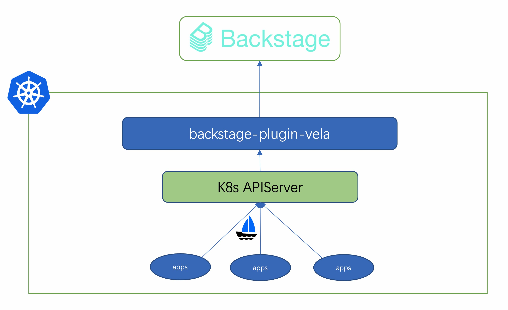

# backstage-plugin-kubevela

It's a plugin of backstage that can make kubevela application work as backstage services.

It leverages the [External integrations](https://backstage.io/docs/features/software-catalog/external-integrations) and works as a `Custom Entity Providers`.

This plugin will connect to Kubernetes API and request vela applications, it provides an API endpoint for serving entities for backstage app.

As a result, you just need to follow the [Creating an Entity Provider](https://backstage.io/docs/features/software-catalog/external-integrations#creating-an-entity-provider) guide on the backstage side to use the plugin as an endpoint.



# Install and Run

## Installation

### Run as Docker Image

If you want to run it locally with the docker image, you need kubeconfig in your environment.

```shel
docker run -p 8080:8080 --rm -it -v ~/.kube:/root/.kube  oamdev/backstage-plugin-kubevela
```

### Run as Vela Addon

```shell
vela addon registry add experimental --type=helm --endpoint=https://addons.kubevela.net/experimental/
vela addon enable backstage
```

If you want to test it locally, you can run the port-forward command and choose `backstage-plugin-vela` component:

```shell
vela port-forward addon-backstage -n vela-system
```

## Develop

* Local Run
```shell
go run .
```

## System Model Integration

* A vela application will convert to a backstage system.
* Resources created by vela component, will convert to backstage components.
* Resources can be marked by annotations to represent more backstage information as the [Well Known Annotations](#Well-Known-Annotations) section described.  

## Well Known Annotations

KubeVela will sync with the backstage [Well-known Annotations](https://backstage.io/docs/features/software-catalog/well-known-annotations), besides that,
KubeVela adds some more annotations that can help sync data from vela application to backstage spec.

| Annotations                           |               Usage        |
| :------------------------------------: | :---------------------------------------:|
|    `backstage.oam.dev/owner`        |  Owner of the app synced to backstage |
|    `backstage.oam.dev/domain`        | Domain of the app synced to backstage  |
|    `backstage.oam.dev/system`        | System of the app synced to backstage, by default its the name of application  |
|    `backstage.oam.dev/description`        |    Description of the app synced to backstage | 
|    `backstage.oam.dev/title`        |   Title of the app synced to backstage |
|    `backstage.oam.dev/tags`        |   Tags of the app synced to backstage, split by `,`  |

The annotations and labels of vela application will be automatically injected on syncing, while vela component need a backstage trait for this, check the [example app](./examples/app.yaml) for details.

## More Integration

- [ ] Add [Well-known Relations between Catalog Entities](https://backstage.io/docs/features/software-catalog/well-known-relations)
- [ ] Add [Kind API](https://backstage.io/docs/features/software-catalog/descriptor-format#kind-api) to integrate with backstage API